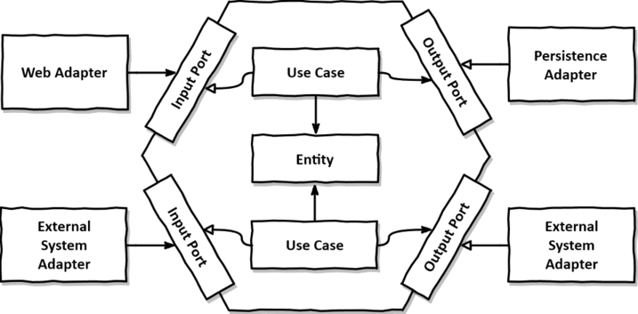
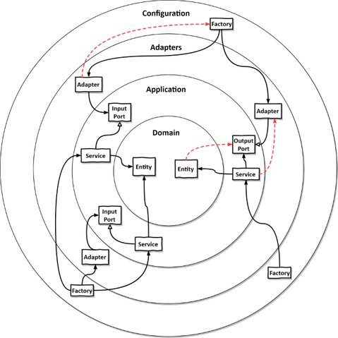
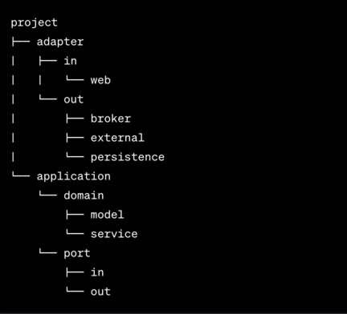

# Test Device Manager

The project adopts the Hexagonal Architecture style, also known as Ports and Adapters architecture. 
This architectural pattern emphasizes a clear separation of concerns and promotes modularity and flexibility within the system.

### About Hexagonal Architecture

The key aspect of "Hexagonal Architecture," in contrast to the traditional layered architecture,
is that dependencies between components are directed "inward," toward the domain objects.
The hexagon is a concept used to describe the core of the application, consisting of domain objects, use cases that manipulate them,
and input and output ports that serve as the interface to external systems.

### Enforcing Architecture Boundaries

Enforcing architectural boundaries involves ensuring that dependencies are properly aligned.
Dashed arrows indicate dependencies that do not conform to our architecture.

The innermost layer encompasses domain entities,which are utilized by the application layer to execute use cases via application services.
Adapters interact with these services through incoming ports or are accessed by these services through outgoing ports.
The configuration layer hosts factories responsible for creating adapter and service objects, supplying them to a dependency injection mechanism.

In the provided diagram, the architecture boundaries are clearly defined, with distinct boundaries separating each layer from its adjacent layers, both inward and outward. 
Following the dependency rule, dependencies crossing these layer boundaries should always point inward.

### Package Structure

In the project, a package structure has been designed to adhere to the principles of Hexagonal Architecture. 
This organized structure effectively incorporates architectural elements such as entities, use cases, input/output ports, and their corresponding adapters.

Delving into the package structure:

Within the structure, each package corresponds to a distinct architectural component:

- **Adapter Package**: This package encompasses both incoming and outgoing adapters. 
Incoming adapters, such as 'web', manage incoming requests, while outgoing adapters ('broker', 'external', 'persistence') facilitate interactions with external systems or storage.

- **Application Package**: At the core of the application lies the "hexagon" in Hexagonal Architecture. The domain package hosts entities and services, embodying the domain logic. Meanwhile, the port package, residing within the application, houses interfaces defining communication ports. Placing the port package within the application indicates the application's control over these ports, enforcing the Dependency Inversion Principle.

- **Domain Package**: It encapsulates domain entities and services, aligning with the implementation of input ports and orchestrating interactions within the domain entities.

This structured representation establishes a clear link between architectural concepts and the corresponding codebase.

