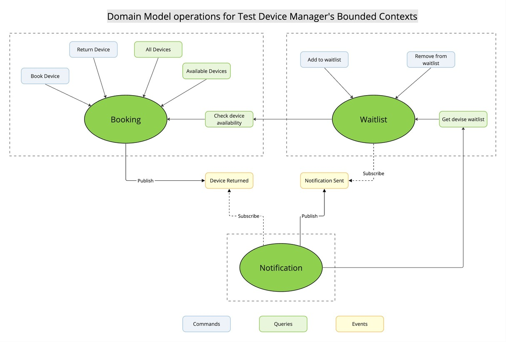

# Test Device Manager

The Test Device Manager application is designed to streamline the process of booking and managing devices for testing purposes. It comprises several modules, each serving a specific purpose in the overall functionality of the system. This document focuses on detailing the functionalities and features of three key modules: Booking Module, Device Waitlist Module, and Notification Module.

### Booking Module

The Booking Module serves as the central component responsible for managing the booking lifecycle of devices within the Test Device Manager application. Users can book available devices, return booked ones, and retrieve information about device availability. In this project, users are limited to booking devices only for the current day, which simplifies the process. Once a device is booked, it remains available for testing for as long as necessary and is returned after testing completion. Future enhancements may include the ability to book devices for future dates.

#### Features:

1. **Book Device**: Users can book a device by specifying its serial number.

2. **Return Device**: Booked devices can be returned by providing their serial number.

3. **Check Device Availability**: Users can retrieve a list of available devices for booking.

4. **View Device Status**: Obtain a list of all devices along with their booking status.

### Device Waitlist Module

The Device Waitlist Module enables users to join a waitlist for a device when it is not currently available for booking. It manages the waitlist and notifies users when the desired device becomes available.

#### Features:

1. **Join Waitlist**: Users can add themselves to the waitlist for a device.

2. **Leave Waitlist**: Users have the option to remove themselves from the waitlist for a device.

3. **Automatic Removal**: Users are automatically removed from the waitlist upon notification of device availability.

### Notification Module

The Notification Module facilitates communication between the system and users on the waitlist by managing notifications about device availability. It supports various notification channels and utilizes an event-driven architecture for efficient notification handling.

#### Features:

1. **Notification Creation**: Allows the creation of notifications with customizable messages and recipient lists.

2. **Multiple Notification Channels**: Supports notification delivery through email, SMS, and push notifications, catering to users' preferred communication channels. Please note that the actual sending of notifications is not implemented in this test project, but it can be added as needed.

3. **Event-driven Architecture**: Utilizes an event-driven architecture to trigger notifications in response to system events, such as device returns. It publishes domain events like NotificationSent, which other modules can consume to perform relevant actions, such as removing users from the waitlist.

The Test Device Manager application's Booking, Device Waitlist, and Notification modules collectively provide a comprehensive solution for managing device bookings and waitlists while keeping users informed about device availability. Future enhancements may include additional features such as booking devices for future dates and extending notification capabilities to support more communication channels.

Here is the Context Map diagram illustrating the relationships and interactions among various modules within the Test Device Manager system. Additionally, the diagram encompasses the domain model operations for the bounded contexts within the Test Device Manager domain.

